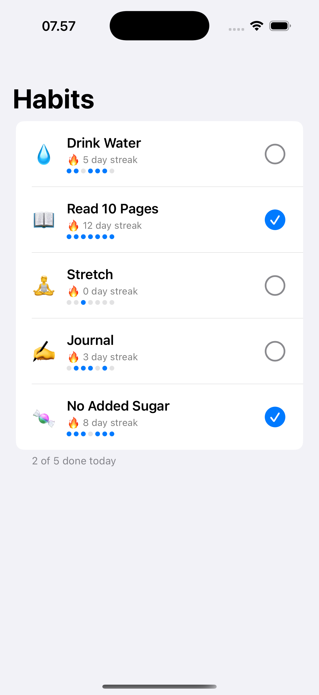

# Habit Tracker

A single-screen SwiftUI app that lists daily habits, shows each one's streak and last-7-day history, and lets you check it off for today.



*Running in the iOS Simulator. The five habits, their streaks and the 7-day dot
rows all come from `mock/habits.json`.*

<details>
<summary>The original hand-drawn mockup, from before it was built</summary>


The project was written on a Linux CI runner with no Xcode, so this mockup stood
in for a screenshot until the app was actually run.

</details>

## How to run

Requires Xcode 16+ (Swift 6 toolchain) on macOS.

```bash
swift build
swift test
```

To actually see the screen, open the package in Xcode, add a new iOS App target, set `HabitTrackerApp` (from the `HabitTracker` library) as its `@main` entry point, and run it in the simulator.

## Stack

- Swift 6, SwiftUI, `@Observable` for the view model (`HabitListModel`)
- Swift Package Manager, no external dependencies
- Habits read from `mock/habits.json` (bundled as a Swift package resource) through a `HabitRepository` protocol — `MockHabitRepository` is the only implementation today; a networked one can replace it later without touching the view model or views
- Unit tests (`Tests/HabitTrackerTests`) cover the streak/toggle logic in `Habit`, using the `Testing` framework

## Limitations

- **Built and run in the iOS Simulator** — see the screenshot above. It was
  originally written on a Linux CI runner where `swift build` fails on
  `import SwiftUI` (`error: no such module 'SwiftUI'`), so it shipped unverified
  and said so; that no longer applies.
- No persistence: toggling a habit only updates in-memory state: relaunching the app (in a real iOS environment) resets to the fixture data in `mock/habits.json`.
- No way to add, edit, or delete habits — the list is fixed to what's in the fixture.
