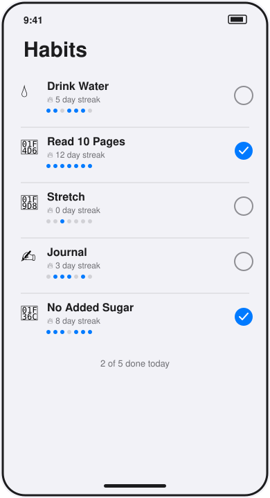

# Habit Tracker

A single-screen SwiftUI app that lists daily habits, shows each one's streak and last-7-day history, and lets you check it off for today.



*UI mockup — hand-drawn, not a screenshot. This sandbox is Linux with no Xcode and no iOS simulator, so the app was written but never launched or tapped through.*

## How to run

Requires Xcode 16+ (Swift 6 toolchain) on macOS.

```bash
cd projects/2026-09-10-ios-habit-tracker
swift build
swift test
```

To actually see the screen, open the package in Xcode, add a new iOS App target, set `HabitTrackerApp` (from the `HabitTracker` library) as its `@main` entry point, and run it in the simulator.

## Stack

- Swift 6, SwiftUI, `@Observable` for the view model (`HabitListModel`)
- Swift Package Manager, no external dependencies
- Habits read from `mock/habits.json` (bundled as a Swift package resource) through a `HabitRepository` protocol — `MockHabitRepository` is the only implementation today; a networked one can replace it later without touching the view model or views
- Unit tests (`Tests/HabitTrackerTests`) cover the streak/toggle logic in `Habit`, using the `Testing` framework

## Limitations

- **Not built or run.** This runner has a Swift 6 toolchain but is Linux, and SwiftUI does not exist there — `swift build` fails immediately on `import SwiftUI` (confirmed while building this project: `error: no such module 'SwiftUI'`). The Swift source is clean, complete, and not placeholder code, but it has only been read, never compiled.
- No persistence: toggling a habit only updates in-memory state: relaunching the app (in a real iOS environment) resets to the fixture data in `mock/habits.json`.
- No way to add, edit, or delete habits — the list is fixed to what's in the fixture.
